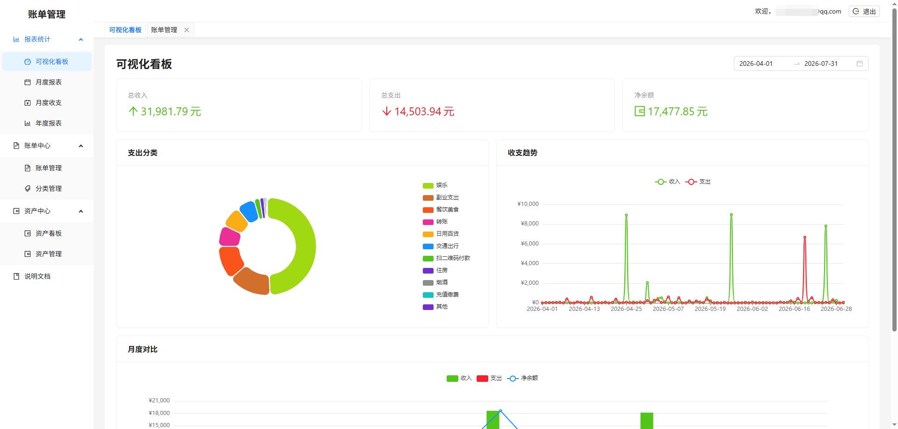
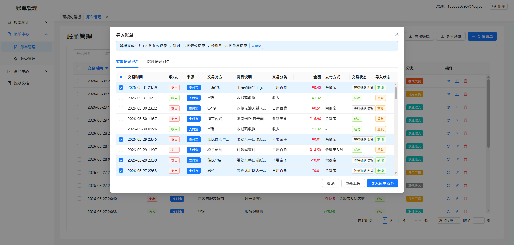
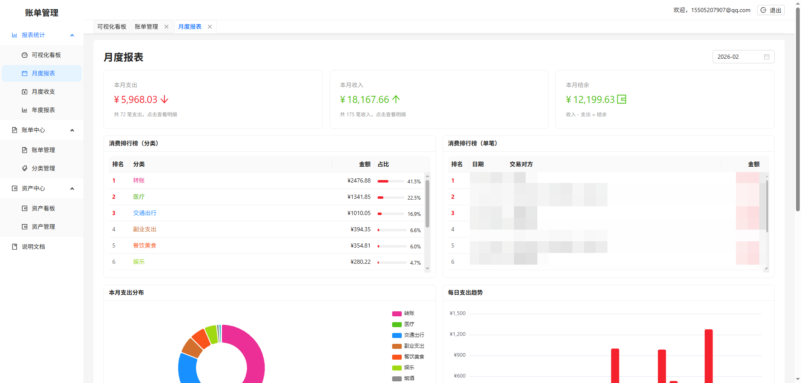
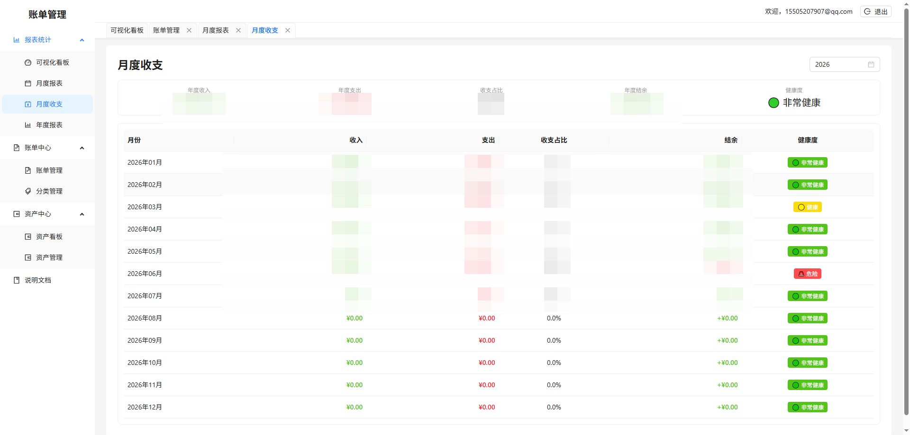
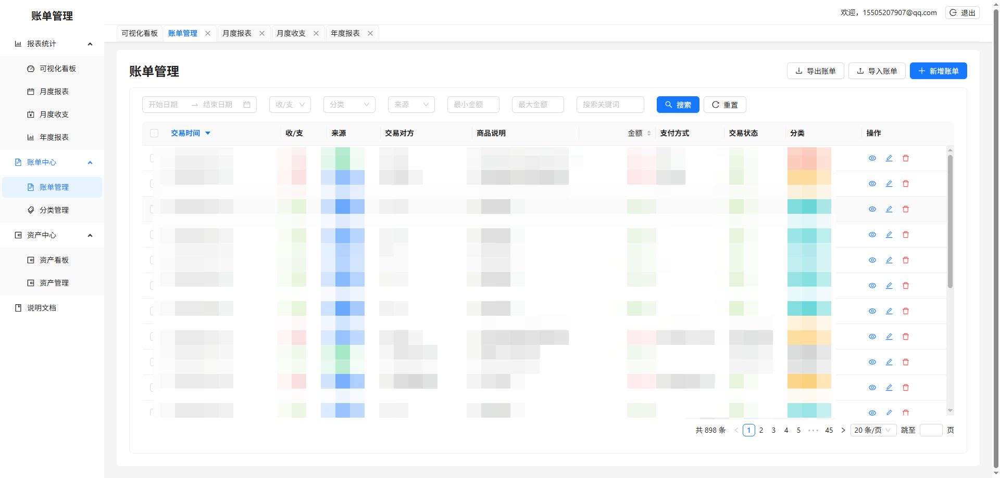
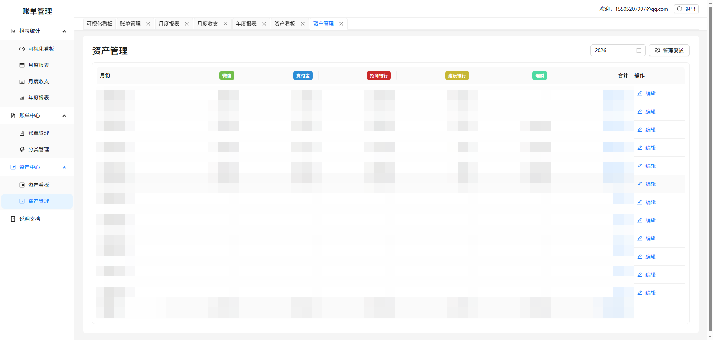

# 个人账单管理系统

个人账单管理系统是一个面向个人记账、消费复盘和资产跟踪的 Web 应用。它的目标不是再做一个只能手动记几笔账的小工具，而是尽量把日常已经产生的支付数据利用起来：通过导入微信、支付宝账单，将分散在不同平台里的交易记录整理成统一、可筛选、可统计、可长期沉淀的个人财务数据。

项目围绕“导入、整理、分析、复盘”这条使用流程设计。用户可以批量导入账单，在预览阶段检查解析结果和疑似重复记录；导入后可以通过时间、金额、分类、平台、关键词等条件快速筛选账单；系统还会基于账单数据生成收支概览、分类占比、月度报表、年度报表等统计视图，帮助用户看清钱花在哪里、收入和支出如何变化，以及哪些消费习惯值得调整。

除了日常收支记录，项目也提供了资产管理能力。用户可以维护银行卡、现金、理财账户等资产渠道，并按月记录资产快照，用来观察个人资产变化趋势。这样账单记录更偏向“流水”，资产记录更偏向“余额”，两者结合后可以更完整地回顾自己的财务状态。

技术上，项目采用前后端分离架构：前端基于 React + Ant Design + ECharts 构建交互界面和数据可视化，后端基于 Node.js + Express + MySQL 提供用户认证、账单解析、数据管理和统计接口。项目适合个人本地部署、自用记账，也适合作为 React、Express、MySQL、文件导入解析、财务统计类系统的学习和二次开发参考。




## 功能特性

- 账单导入：支持微信 Excel 账单、支付宝 CSV 账单解析导入。
- 重复检测：导入预览阶段检测疑似重复账单，减少重复入账。
- 账单管理：支持新增、编辑、删除、批量删除、批量更新、分页、排序、筛选和关键字搜索。
- 分类管理：支持自定义分类，结合账单数据做分类统计。
- 数据看板：展示收入、支出、结余、趋势、分类占比等统计信息。
- 月度报表：按月查看收支结构和消费明细。
- 年度报表：按年汇总收支趋势、月份对比和重点支出。
- 资产管理：支持维护资产渠道和每月资产快照，查看资产变化。
- 用户体系：支持注册、登录、JWT 鉴权和用户数据隔离。
- 响应式界面：基于 Ant Design 构建，兼顾桌面端和较小屏幕使用。

## 界面截图












## 技术栈

### 前端

- React 18
- React Router 6
- Ant Design 5
- ECharts / echarts-for-react
- Axios
- Day.js
- Create React App

### 后端

- Node.js
- Express
- MySQL / mysql2
- JWT
- bcrypt
- multer
- xlsx
- iconv-lite

## 项目结构

```text
.
├── backend
│   ├── database
│   │   ├── init.js
│   │   └── schema.sql
│   └── src
│       ├── config
│       ├── middleware
│       ├── parsers
│       ├── routes
│       ├── services
│       ├── app.js
│       └── index.js
├── frontend
│   ├── public
│   └── src
│       ├── components
│       ├── pages
│       ├── services
│       └── utils
└── README.md
```

## 快速开始

### 环境要求

- Node.js 16+，建议使用 LTS 版本
- npm
- MySQL 5.7+ 或 MySQL 8+

### 1. 克隆项目

```bash
git clone <your-repository-url>
cd gezhang
```

### 2. 初始化数据库

先在 MySQL 中创建数据库和表结构：

```bash
mysql -u root -p < backend/database/schema.sql
```

默认数据库名为 `bill_manager`。如需修改数据库名、账号或密码，请在后端环境变量中配置。

### 3. 配置后端环境变量

在 `backend` 目录下创建 `.env` 文件：

```env
NODE_ENV=development
PORT=3001

DB_HOST=localhost
DB_PORT=3306
DB_USER=root
DB_PASSWORD=your_mysql_password
DB_NAME=bill_manager

JWT_SECRET=please_change_this_secret
JWT_EXPIRES_IN=7d

CORS_ORIGINS=http://localhost:3000,http://127.0.0.1:3000
```

### 4. 启动后端

```bash
cd backend
npm install
npm run dev
```

后端服务默认运行在 `http://localhost:3001`。

### 5. 启动前端

另开一个终端：

```bash
cd frontend
npm install
npm start
```

前端开发服务默认运行在 `http://localhost:3000`，并通过 `frontend/package.json` 中的 `proxy` 转发接口请求到后端。

## 常用命令

### 后端

```bash
cd backend
npm run dev      # 开发模式
npm start        # 生产方式启动
npm test         # 运行测试
npm run db:init  # 执行数据库初始化脚本
```

### 前端

```bash
cd frontend
npm start        # 开发模式
npm run build    # 构建生产包
npm test         # 运行测试
```

## 账单导入说明

当前导入逻辑会根据文件后缀自动选择解析器：

- `.xlsx` / `.xls`：按微信账单 Excel 解析。
- `.csv`：按支付宝账单 CSV 解析。

导入流程分为解析预览和批量保存两个阶段。系统会在预览阶段返回有效记录、跳过数量、解析错误和疑似重复记录，用户确认后再保存到账单表。

为保护个人隐私，提交 Issue 或 Pull Request 时请勿上传真实账单文件、真实订单号、真实商户信息或完整个人资产截图。建议使用脱敏数据或自行构造的测试文件。

## 环境变量

| 变量名 | 默认值 | 说明 |
| --- | --- | --- |
| `NODE_ENV` | `development` | 运行环境 |
| `PORT` | `3001` | 后端服务端口 |
| `DB_HOST` | `localhost` | MySQL 主机 |
| `DB_PORT` | `3306` | MySQL 端口 |
| `DB_USER` | `root` | MySQL 用户名 |
| `DB_PASSWORD` | 空 | MySQL 密码 |
| `DB_NAME` | `bill_manager` | 数据库名称 |
| `JWT_SECRET` | `default_jwt_secret_change_in_production` | JWT 签名密钥，生产环境必须修改 |
| `JWT_EXPIRES_IN` | `7d` | Token 有效期 |
| `CORS_ORIGINS` | `http://localhost:3000,http://127.0.0.1:3000` | 允许跨域访问的前端地址，多个地址用英文逗号分隔 |

## 开源前建议

- 新增 `LICENSE` 文件，并确认许可证与 README 中声明一致。
- 新增 `.env.example`，只放示例配置，不包含真实密码和密钥。
- 检查提交历史和示例截图，确保没有真实账单、手机号、邮箱、订单号、Cookie、Token、数据库密码等敏感信息。
- 如果要在 GitHub 和 Gitee 同步维护，建议保持默认分支、标签和 Release 说明一致。

## 开发说明

后端主要模块：

- `backend/src/routes`：API 路由。
- `backend/src/services`：业务逻辑。
- `backend/src/parsers`：微信、支付宝账单解析与校验。
- `backend/database`：数据库结构和初始化脚本。

前端主要模块：

- `frontend/src/pages`：页面级组件。
- `frontend/src/components`：通用组件和业务组件。
- `frontend/src/services`：接口请求封装。
- `frontend/src/utils`：工具函数。

## 贡献

欢迎提交 Issue 和 Pull Request。建议在提交前先完成以下检查：

```bash
cd backend
npm test

cd ../frontend
npm test
```

如果改动涉及账单导入、金额计算、时间解析或统计口径，请在 PR 中说明测试数据来源、覆盖场景和可能影响的页面。

## 许可证

MIT License
